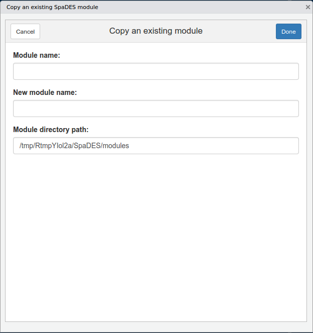

# Using RStudio addins

RStudio addins provide a graphical interface for performing common tasks.
After installing the `SpaDES.addins` package, go to the Addins menu in the RStudio IDE to see the list of available addins provided by this package.

You can assign keyboard shortcuts to any of these addins if you wish.
See https://rstudio.github.io/rstudioaddins/#running-addins.

## `SpaDES` module directory

The default module directory is a temporary one, and can be changed using `SpaDES.core::setPaths()`.
See `?SpaDES.core::setPaths` for details.

We recommend using a single local directory for your `SpaDES` modules.
Thus, only a single module directory is specified when using these addins.

# `SpaDES` module development

## Copy an existing module

The simplest way to get started on developing a `SpaDES` module, is to start from an existing module.
Anytime you wish to modify an existing module, we suggest working from a copy, rather than modifying the existing module directly.
To copy an existing module, simply invoke the *SpaDES: copy module* addin from the RStudio Addins menu.

## Create a new `SpaDES` module from a template

# `SpaDES` package development (advanced)

More advanced users planning on contributing code to the `SpaDES` ecosystem of packages, can make use of additional package development tools.
